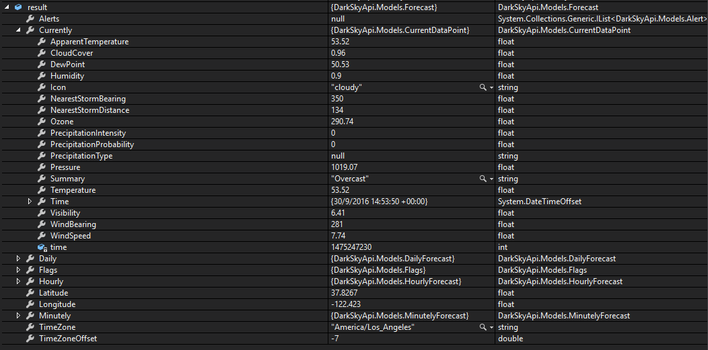

# DarkSkyApi []()

An unofficial C# Portable Class Library for the [Dark Sky](https://darksky.net/dev) weather service. Compatible with .NET 4.5, Windows 8/8.1, Windows Phone 8/8.1, .NET Core 1.0, Xamarin Android/iOS, and Universal Windows Apps.

## Installation

[NuGet](https://www.nuget.org/packages/DarkSkyApi/): `Install-Package DarkSkyApi`

## New in Version 3.0.0 (30 September 2016)

[Full Changelog](CHANGELOG.md)

ForecastPCL is now DarkSkyApi! Almost everything's the same, but the new name better matches the Dark Sky rebranding.

- **Migration Details**

  - Renamed ForecastApi to DarkSkyService.
  - Moved everything in the ForecastIOPortable namespace to the DarkSkyApi namespace.
  - Moved everything in the ForecastIOPortable.Models namespace to the DarkSkyApi.Models namespace.
  - Moved everything in the ForecastIOPortable.Helpers namespace to the DarkSkyApi.Helpers namespace.

- **New Languages**

  - Added support for Azerbaijani.

### Migrating from ForecastPCL

1. Uninstall the `ForecastIOPortable` NuGet package.
2. Install the `DarkSkyApi` package from NuGet.
3. Replace all references to `ForecastIOPortable` namespaces with the corresponding `DarkSkyApi` ones:

| ForecastPCL Namespace | DarkSkyApi Namespace |
| --- | --- |
| ForecastIOPortable | DarkSkyApi |
| ForecastIOPortable.Models  | DarkSkyApi.Models |
| ForecastIOPortable.Helpers | DarkSkyApi.Helpers |

## Quick Start

### Current Conditions

```c#
using DarkSkyApi;
using DarkSkyApi.Models;

...

var client = new DarkSkyService("YOUR API KEY HERE");
Forecast result = await client.GetWeatherDataAsync(37.8267, -122.423);

...
```



Note that the Dark Sky service doesn't always return all fields for each region. In these cases, some properties may be null or zero.

### Conditions for a specific date

```c#
using DarkSkyApi;
using DarkSkyApi.Models;

...

var client = new DarkSkyService("YOUR API KEY HERE");

Forecast result = await client.GetTimeMachineWeatherAsync(37.8267, -122.423, DateTimeOffset.Now);

...
```

The `Helpers` class contains extension methods to convert a DateTimeOffset to Unix time, and back:

```c#

int unixTime = DateTimeOffset.Now.ToUnixTime();

DateTimeOffset date = unixTime.ToDateTimeOffset();
```

### API Usage Information

After making a request for data (be it current or historical), the DarkSkyService instance's `ApiCallsMade` property will contain the number of calls made today, using the given API key. The property will be null if no requests have been made through the particular instance.

## Design

This library uses a client-oriented approach, instead of a request-response model: the `DarkSkyService` object is intended to be an abstraction from which weather data (`Forecast`s) can be obtained.

`Forecast`s do contain all the fields that can appear in the raw JSON obtained through making a direct request to the web service, but exposes them through more .NET convention-friendly properties: for example, `precipIntensityMax` is exposed as `MaxPrecipitationIntensity`. These properties are (as shown here) sometimes more verbose, but were intended to match the style commonly used in .NET projects.

## Tests

NUnit is used for some simple integration tests with the actual web service. To run the tests, a valid API key must be added to the `app.config` file in the `DarkSkyService.Test` folder.
